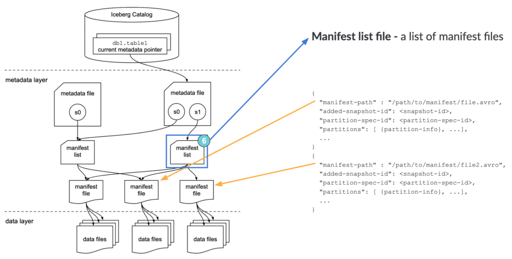

Read [This](https://www.dremio.com/resources/guides/apache-iceberg-an-architectural-look-under-the-covers/?utm_campaign=Search%20%2d%20Nonbrand%20%2d%20Iceberg%20%2d%20Global&utm_medium=cpc&utm_source=google&utm_term=apache%20iceberg%20architecture&campaignid=21254670688&adgroupid=161477881323&matchtype=e&gad_source=1&gclid=Cj0KCQiAvvO7BhC-ARIsAGFyToV_QZ1IyhUm7jvd2Jv0FIUHKyVE5be247JL5OEN0aVCMU8cqMhXLOEaAhLBEALw_wcB).


There are 3 layers in the architecture of an Iceberg table:

1. The Iceberg catalog
2. The metadata layer, which contains metadata files, manifest lists, and manifest files
3. The data layer


## Iceberg catalog
Anyone reading from a table (let alone 10s, 100s, or 1,000s) needs to know where to go first — somewhere they can go to find out where to read/write data for a given table. The first step for anyone looking to read the table is to find the location of the current metadata pointer (note the term “current metadata pointer” is not an official term, but rather a descriptive term because there is no official term at this point and there hasn’t been push-back in the community on it).

This central place where you go to find the current location of the current metadata pointer is the Iceberg catalog.

The primary requirement for an Iceberg catalog is that it must support atomic operations for updating the current metadata pointer (e.g., HDFS, Hive Metastore, Nessie). This is what allows transactions on Iceberg tables to be atomic and provide correctness guarantees.

Within the catalog, there is a reference or pointer for each table to that table’s current metadata file. For example, in the diagram shown above, there are 2 metadata files. The value for the table’s current metadata pointer in the catalog is the location of the metadata file on the right.

What this data looks like is dependent on what Iceberg catalog is being used. A few examples:

- With HDFS as the catalog, there’s a file called version-hint.text in the table’s metadata folder whose contents is the version number of the current metadata file.
- With Hive metastore as the catalog, the table entry in the metastore has a table property which stores the location of the current metadata file.
- With Nessie as the catalog, Nessie stores the location of the current metadata file for the table.

> So, when a SELECT query is reading an Iceberg table, the query engine first goes to the Iceberg catalog, then retrieves the entry of the location of the current metadata file for the table it’s looking to read, then opens that file.


## Metadata file

As the name implies, metadata files store metadata about a table. This includes information about the table’s schema, partition information, snapshots, and which snapshot is the current one.


While the above is an abridged sample for illustration purposes, here is an example of the full contents of a metadata file:
`v3.metadata.json`

```
{
    "format-version" : 1,
    "table-uuid" : "4b96b6e8-9838-48df-a111-ec1ff6422816",
    "location" : "/home/hadoop/warehouse/db2/part_table2",
    "last-updated-ms" : 1611694436618,
    "last-column-id" : 3,
    "schema" : {
        "type" : "struct",
        "fields" : [ {
            "id" : 1,
            "name" : "id",
            "required" : true,
            "type" : "int"
        }, {
            "id" : 2,
            "name" : "ts",
            "required" : false,
            "type" : "timestamptz"
        }, {
            "id" : 3,
            "name" : "message",
            "required" : false,
            "type" : "string"
        } ]
    },
    "partition-spec" : [ {
        "name" : "ts_hour",
        "transform" : "hour",
        "source-id" : 2,
        "field-id" : 1000
    } ],
    "default-spec-id" : 0,
    "partition-specs" : [ {
        "spec-id" : 0,
        "fields" : [ {
            "name" : "ts_hour",
            "transform" : "hour",
            "source-id" : 2,
            "field-id" : 1000
        } ]
    } ],
    "default-sort-order-id" : 0,
    "sort-orders" : [ {
        "order-id" : 0,
        "fields" : [ ]
    } ],
    "properties" : {
        "owner" : "hadoop"
    },
    "current-snapshot-id" : 1257424822184505371,
    "snapshots" : [ {
        "snapshot-id" : 8271497753230544300,
        "timestamp-ms" : 1611694406483,
        "summary" : {
            "operation" : "append",
            "spark.app.id" : "application_1611687743277_0002",
            "added-data-files" : "1",
            "added-records" : "1",
            "added-files-size" : "960",
            "changed-partition-count" : "1",
            "total-records" : "1",
            "total-data-files" : "1",
            "total-delete-files" : "0",
            "total-position-deletes" : "0",
            "total-equality-deletes" : "0"
        },
        "manifest-list" : "/home/hadoop/warehouse/db2/part_table2/metadata/snap-8271497753230544300-1-d8a778f9-ad19-4e9c-88ff-28f49ec939fa.avro"
    }, 
    {
        "snapshot-id" : 1257424822184505371,
        "parent-snapshot-id" : 8271497753230544300,
        "timestamp-ms" : 1611694436618,
        "summary" : {
            "operation" : "append",
            "spark.app.id" : "application_1611687743277_0002",
            "added-data-files" : "1",
            "added-records" : "1",
            "added-files-size" : "973",
            "changed-partition-count" : "1",
            "total-records" : "2",
            "total-data-files" : "2",
            "total-delete-files" : "0",
            "total-position-deletes" : "0",
            "total-equality-deletes" : "0"
        },
        "manifest-list" : "/home/hadoop/warehouse/db2/part_table2/metadata/snap-1257424822184505371-1-eab8490b-8d16-4eb1-ba9e-0dede788ff08.avro"
    } ],
    "snapshot-log" : [ {
        "timestamp-ms" : 1611694406483,
        "snapshot-id" : 8271497753230544300
    }, 
    {
        "timestamp-ms" : 1611694436618,
        "snapshot-id" : 1257424822184505371
    } ],
    "metadata-log" : [ {
        "timestamp-ms" : 1611694097253,
        "metadata-file" : "/home/hadoop/warehouse/db2/part_table2/metadata/v1.metadata.json"
    }, 
    {
        "timestamp-ms" : 1611694406483,
        "metadata-file" : "/home/hadoop/warehouse/db2/part_table2/metadata/v2.metadata.json"
    } ]
}
```

> When a SELECT query is reading an Iceberg table and has its current metadata file open after getting its location from the table’s entry in the catalog, the query engine then reads the value of current-snapshot-id. It then uses this value to find that snapshot’s entry in the snapshots array, then retrieves the value of that snapshot’s manifest-list entry, and opens the manifest list that location points to.

## Manifest List

Another aptly named file, the manifest list is a list of manifest files. The manifest list has information about each manifest file that makes up that snapshot, such as the location of the manifest file, what snapshot it was added as part of, and information about the partitions it belongs to and the lower and upper bounds for partition columns for the data files it tracks.

Here’s an example of the full contents of a manifest list file:
`snap-1257424822184505371-1-eab8490b-8d16-4eb1-ba9e-0dede788ff08.avro`(converted to JSON)




```
{
    "manifest_path": "/home/hadoop/warehouse/db2/part_table2/metadata/eab8490b-8d16-4eb1-ba9e-0dede788ff08-m0.avro",
    "manifest_length": 4884,
    "partition_spec_id": 0,
    "added_snapshot_id": {
        "long": 1257424822184505300
    },
    "added_data_files_count": {
        "int": 1
    },
    "existing_data_files_count": {
        "int": 0
    },
    "deleted_data_files_count": {
        "int": 0
    },
    "partitions": {
        "array": [ {
            "contains_null": false,
            "lower_bound": {
                "bytes": "¹Ô\\u0006\\u0000"
            },
            "upper_bound": {
                "bytes": "¹Ô\\u0006\\u0000"
            }
        } ]
    },
    "added_rows_count": {
        "long": 1
    },
    "existing_rows_count": {
        "long": 0
    },
    "deleted_rows_count": {
        "long": 0
    }
}
{
    "manifest_path": "/home/hadoop/warehouse/db2/part_table2/metadata/d8a778f9-ad19-4e9c-88ff-28f49ec939fa-m0.avro",
    "manifest_length": 4884,
    "partition_spec_id": 0,
    "added_snapshot_id": {
        "long": 8271497753230544000
    },
    "added_data_files_count": {
        "int": 1
    },
    "existing_data_files_count": {
        "int": 0
    },
    "deleted_data_files_count": {
        "int": 0
    },
    "partitions": {
        "array": [ {
            "contains_null": false,
            "lower_bound": {
                "bytes": "¸Ô\\u0006\\u0000"
            },
            "upper_bound": {
                "bytes": "¸Ô\\u0006\\u0000"
            }
        } ]
    },
    "added_rows_count": {
        "long": 1
    },
    "existing_rows_count": {
        "long": 0
    },
    "deleted_rows_count": {
        "long": 0
    }
}
```

> When a SELECT query is reading an Iceberg table and has the manifest list open for the snapshot after getting its location from the metadata file, the query engine then reads the value of the manifest-path entries, and opens the manifest files. It could also do some optimizations at this stage like using row counts or filtering of data using the partition information.

## Manifest file

Manifest files track data files as well as additional details and statistics about each file. As mentioned earlier, the primary difference that allows Iceberg to address the problems of the Hive table format is tracking data at the file level — manifest files are the boots on the ground that do that.

Each manifest file keeps track of a subset of the data files for parallelism and reuse efficiency at scale. They contain a lot of useful information that is used to improve efficiency and performance while reading the data from these data files, such as details about partition membership, record count, and lower and upper bounds of columns. These statistics are written for each manifest’s subset of data files during write operation, and are therefore more likely to exist, be accurate, and be up to date than statistics in Hive.

As to not throw the baby out with the bathwater, Iceberg is file-format agnostic, so the manifest files also specify the file format of the data file, such as Parquet, ORC, or Avro.

Here’s an example of the full contents of a manifest file:
`eab8490b-8d16-4eb1-ba9e-0dede788ff08-m0.avro (converted to JSON)`


```
{
    "status": 1,
    "snapshot_id": {
        "long": 1257424822184505300
    },
    "data_file": {
        "file_path": "/home/hadoop/warehouse/db2/part_table2/data/ts_hour=2021-01-26-01/00000-6-7c6cf3c0-8090-4f15-a4cc-3a3a562eed7b-00001.parquet",
        "file_format": "PARQUET",
        "partition": {
            "ts_hour": {
                "int": 447673
            }
        },
        "record_count": 1,
        "file_size_in_bytes": 973,
        "block_size_in_bytes": 67108864,
        "column_sizes": {
            "array": [ {
                "key": 1,
                "value": 47
            },
            {
                "key": 2,
                "value": 57
            },
            {
                "key": 3,
                "value": 60
            } ]
        },
        "value_counts": {
            "array": [ {
                "key": 1,
                "value": 1
            },
            {
                "key": 2,
                "value": 1
            },
            {
                "key": 3,
                "value": 1
            } ]
        },
        "null_value_counts": {
            "array": [ {
                "key": 1,
                "value": 0
            },
            {
                "key": 2,
                "value": 0
            },
            {
                "key": 3,
                "value": 0
            } ]
        },
        "lower_bounds": {
            "array": [ {
                "key": 1,
                "value": "\\u0002\\u0000\\u0000\\u0000"
            },
            {
                "key": 2,
                "value": "\\u0000„ ,ù\\u0005\\u0000"
            },
            {
                "key": 3,
                "value": "test message 2"
            } ]
        },
        "upper_bounds": {
            "array": [ {
                "key": 1,
                "value": "\\u0002\\u0000\\u0000\\u0000"
            },
            {
                "key": 2,
                "value": "\\u0000„ ,ù\\u0005\\u0000"
            },
            {
                "key": 3,
                "value": "test message 2"
            } ]
        },
        "key_metadata": null,
        "split_offsets": {
            "array": [
                4
            ]
        }
    }
}

```

> When a SELECT query is reading an Iceberg table and has a manifest file open after getting its location from the manifest list, the query engine then reads the value of the file-path entries for each data-file object, and opens the data files. It could also do some optimizations at this stage like using row counts or filtering of data using the partition or column statistic information.


## A Look Under the Covers When CRUDing

### Create
```
CREATE TABLE table1 (
    order_id BIGINT,
    customer_id BIGINT,
    order_amount DECIMAL(10, 2),
    order_ts TIMESTAMP
)
USING iceberg
PARTITIONED BY ( HOUR(order_ts) );
```


Above, we created a table called table1 in database db1. The table has 4 columns and is partitioned at the hour granularity of the order_ts timestamp column (more on that later).

When the query above is executed, a metadata file with a snapshot s0 is created in the metadata layer (snapshot s0 doesn’t point to any manifest lists because no data exists in the table yet). The catalog entry for db1.table1’s current metadata pointer is then updated to point to the path of this new metadata file.

### Insert

```
INSERT INTO table1 VALUES (
    123,
    456,
    36.17,
    '2021-01-26 08:10:23'
);
```


When we execute this INSERT statement, the following process happens:

1. The data in the form of a Parquet file is first created – `table1/data/order_ts_hour=2021-01-26-08/00000-5-cae2d.parquet`
2. Then, a manifest file pointing to this data file is created (including the additional details and statistics) – `table1/metadata/d8f9-ad19-4e.avro`
3. Then, a manifest list pointing to this manifest file is created (including the additional details and statistics) – `table1/metadata/snap-2938-1-4103.avro`
4. Then, a new metadata file is created based on the previously current metadata file with a new snapshot s1 as well as keeping track of the previous snapshot s0, pointing to this manifest list (including the additional details and statistics) – `table1/metadata/v2.metadata.json`
5. Then, the value of the current metadata pointer for db1.table1 is atomically updated in the catalog to now point to this new metadata file.
During all of these steps, anyone reading the table would continue to read the first metadata file until the atomic step #5 is complete, meaning that no one using the data would ever see an inconsistent view of the table’s state and contents.

### MERGE INTO / UPSERT
Now, let’s step through a MERGE INTO / UPSERT operation.

Let’s assume we’ve landed some data into a staging table we created in the background. In this simple example, information is logged each time there’s a change to the order, and we want to keep this table showing the most recent details of each order, so we update the order amount if the order ID is already in the table. If we don’t have a record of that order yet, we want to insert a record for this new order.

In this example, the stage table includes an update for the order that’s already in the table (order_id=123) and a new order that isn’t in the table yet, which occurred on January 27, 2021 at 10:21:46.


```
MERGE INTO table1
USING ( SELECT * FROM table1_stage ) s
    ON table1.order_id = s.order_id
WHEN MATCHED THEN
    UPDATE table1.order_amount = s.order_amount
WHEN NOT MATCHED THEN
    INSERT *
```


When we execute this MERGE INTO statement, the following process happens:

1. The read path as detailed earlier is followed to determine all records in table1 and table1_stage that have the same `order_id`.
2. The file containing the record with order_id=123 from table1 is read into the query engine’s memory `(00000-5-cae2d.parquet)`, `order_id=123’s` record in this memory copy then has its order_amount field updated to reflect the new order_amount of the matching record in table1_stage. This modified copy of the `original file is then written to a new Parquet file – table1/data/order_ts_hour=2021-01-26-08/00000-1-aef71.parquet`
    - Even if there were other records in the file that didn’t match the order_id update condition, the entire file would still be copied and the one matching record updated as it was copied, and the new file written out — a strategy known as copy-on-write. There is a new data change strategy coming soon in Iceberg known as merge-on-read which will behave differently under the covers, but still provides you the same update and delete functionality.
3. The record in table1_stage that didn’t match any records in table1 gets written in the form of a new Parquet file, because it belongs to a different partition than the matching record – `table1/data/order_ts_hour=2021-01-27-10/00000-3-0fa3a.parquet`
4. Then, a new manifest file pointing to these two data files is created (including the additional details and statistics) – `table1/metadata/0d9a-98fa-77.avro`
    - In this case, the only record in the only data file in snapshot s1 was changed, so there was no reuse of manifest files or data files. Normally this is not the case, and manifest files and data files are reused across snapshots.
5. Then, a new manifest list pointing to this manifest file is created (including the additional details and statistics) – `table1/metadata/snap-9fa1-3-16c3.avro`
6. Then, a new metadata file is created based on the previously current metadata file with a new snapshot s2 as well as keeping track of the previous snapshots s0 and s1, pointing to this manifest list (including the additional details and statistics) – `table1/metadata/v3.metadata.json`
7. Then, the value of the current metadata pointer for db1.table1 is atomically updated in the catalog to now point to this new metadata file.

In the diagram above, we also show that before this MERGE INTO was executed, a background garbage collection job ran to clean up unused metadata files — note that our first metadata file for snapshot s0 when we created the table is no longer there. Because each new metadata file also contains the important information needed from previous ones, these can be cleaned up safely. Unused manifest lists, manifest files, and data files can also be cleaned up via garbage collection.

Let’s review the SELECT path again, but this time on the Iceberg table we’ve been working on.

```
SELECT *
FROM db1.table1
```


When this SELECT statement is executed, the following process happens:

1. The query engine goes to the Iceberg catalog
2. It then retrieves the current metadata file location entry for db1.table1
3. It then opens this metadata file and retrieves the entry for the manifest list location for the current snapshot, s2
4. It then opens this manifest list, retrieving the location of the only manifest file
5. It then opens this manifest file, retrieving the location of the two data files
6. It then reads these data files, and since it’s a SELECT *, returns the data back to the client
