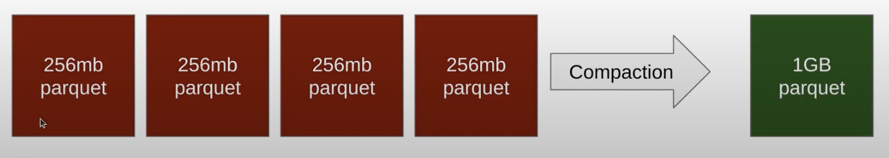
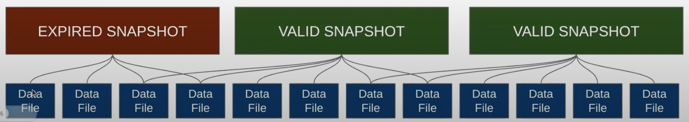
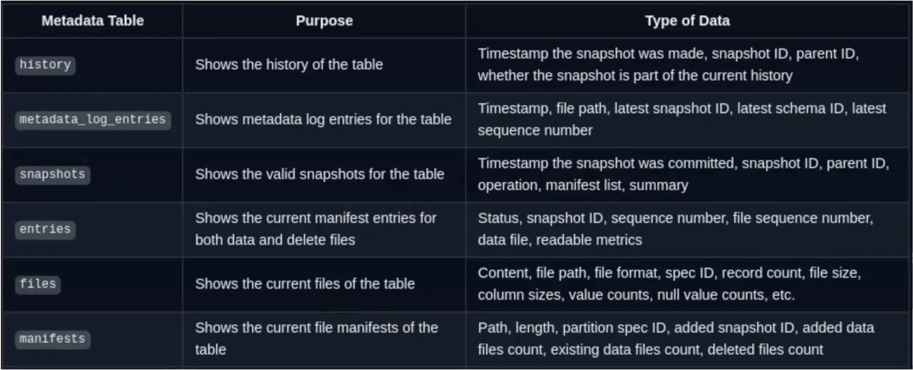

When we are talking about a data lakehouse, we are talking about decoupled layers.
We have to have a little bit of hands-on to make sure the actual physical files of our tables are in top-shape for the optimal performance.

- We dont have too many files for the data we have;
- The data is those files are cluster and partitioned optimally;

### Compaction

**Problem**: Files build up after many writes resulting in more file operations than necessary slowing down queries, this is maximizing when handling "real-time" ingestion.

**Solution**: Rewrite data files so data in many files within the same partition are rewritten to fewer files.



If I run compaction I know have one bigger file, but the older files still exists.

Compaction in Apache Spark would be trough `rewrite_data_files` for example.

We can run compactin with sorting, so as it rewrites the files, it sorts the data within those files, to approppriately cluster it.

We also can run with zorder Sorting, to weight by two columns equally weighted.

In Dremio, you can run compaction by the OPTIMIZE command

`OPTIMIZE TABLE nessie.hr.employees ... `

__________

### Snapshot Expiration

**Problem**: As you collect more and more table spanshots the data files begin to take sizeable storage, also some data from historical snapshots may beed to be deleted for regulatory snapshots.

**Solution**: Set data retention rules and expire snapshots according




In apache spark you can use `expire_snapshots`

```
CALL nessie.system.expire_snapshots(
    table => ...
    older_than => TIMESTAMP ...
    retain_last => 100
);
```
I can target specific snapshots

`snapshot_ids => ARRAY(1,2,3,4)`

If you expire snapshots, you can't time travel to them anymore
Metadata from the metadata tables only contain data for valid snapshots.

In dremio, you can use VACUUM Command

``` 
VACUUM TABLE catalog.hr.employees
EXPIRE SNAPHOSTS older_than '2023-06-01 00:00:00' retain_last 20;

```


_______


## Metadata Tables

Allow us to do analytics on the tables itself understanding file size, partition size, so we can better audit our table to make optimization decisions and identify bottlenecks

**Problem**: Wanting to understand details about the table to know when you need to do maintenance and other optimizations.

**Solution**: Metadata tables allow you to use SQL to better understand the state of your tables.



### Use Cases for the Metadata tables

1. **What is the total sotrage footprint of my table?**: Join `files` and `all_data_files` to sum up the storage sizes of current and historical data files.

2. **Which snapshots contributed the most data?**: Join `snapshots` and `all_data_files` to analyze the record count and file size contribution of each snapshot

3. **What changes have been made to the table's schema over time?**: Join `history` and `metadata_log_entries` to track schema changes and metadata file updates.

4. **Which partitions are growing the fastest?**: Join `partitions` and `all_data_files` to compare partition sizes and record counts over time.

5. **Which data files have been deleted recently?**: Join `history` and `all_delete_files` to identify recently deleted data files and their corresponding snapshots.

6. **How are positional deletes affecting my table?**: Join `position_deletes` and `all_delete_files` to analyze the impact and frequency of positional deletes across snapshots

7. **What is the data distribution across different partitions?**: Join `partitions` and `all_entries` to examine the distribution of data files and delete files across partitions

8. **Which snapshots have the most metadata changes?**: Join `snapshots` and `metadata_log_entries` to find snapshots with significant metadata updates and schema changes.

9. **What is the history of a specific snapshot?**: Join `history` and `snapshots` to trace the ancestry and operations leading to a specific snapshot.

10. **What are the most recent changes to my table?**: Join `history` and `snapshots` to get a detailed view of the latest changes and operations performed on the table.


