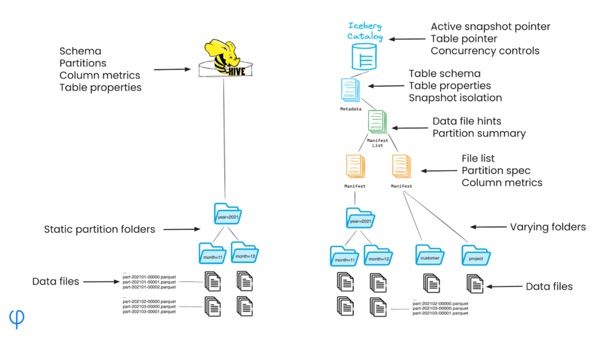

Read [here](https://www.upsolver.com/blog/iceberg-partitioning)

In traditional Hive-based data lakes, rows are partitioned or grouped by a specific column into physical folders  persisted to an object store. For example, data might be partitioned by year, month, and day, with each partition containing the relevant Parquet files. 

The main problem with this approach is its lack of flexibility:

- Changing partition schemes requires restructuring the entire dataset, which can be time-consuming and resource-intensive.
- Adding or removing partition columns often necessitates data rewriting and folder reorganization.
- The partition structure is tightly coupled with the physical storage layout.
Iceberg’s ‘Hidden’ Partitioning

Unlike Hive, Iceberg doesn’t rely on a physical folder structure to define partitions. Instead, partitioning information is stored in metadata files, decoupling the logical partitioning scheme from the physical data layout.

This means that:

- Partition definitions are metadata-based, not physical folder-based.
- Changing partition schemes doesn’t require data rewriting or restructuring.
- Partitions are “hidden” from the storage layer, providing more flexibility in data organization.

Partition information is managed in Iceberg’s **metadata layer**, which includes **partition specs** – versioned definitions of how data should be partitioned – as well as **partition data**, i.e. Information about existing partitions and their contents.

This approach allows for easy modification of partition schemes like adding or modifying a partition column without affecting the underlying data. It also allows more complex and flexible partitioning strategies to improve query planning as business needs evolve.

Partition specs are stored in Iceberg’s manifest files, which provide a flexible and updateable way to define and manage partitions. When you query an Iceberg table, the system uses these manifest files to quickly determine which data files are relevant to your query based on the partition information.